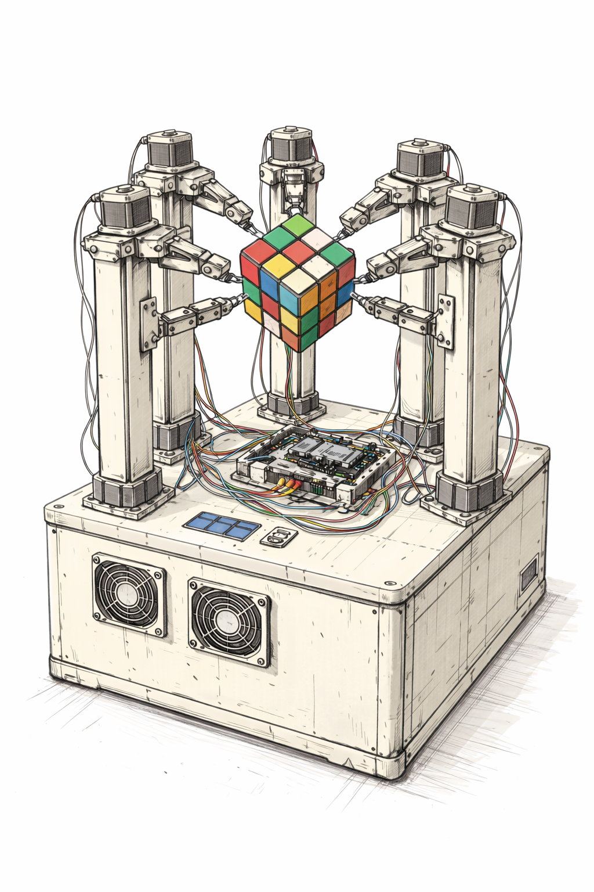

# MechaCubeSolver

**MechaCubeSolver** est un robot mécanique de résolution automatique de Rubik’s Cube.

Le projet repose sur une architecture **100 % mécanique**, avec un cube maintenu en position “diamant”, entraîné par **6 moteurs indépendants** (un par face).

---

MechaCubeSolver est avant tout un projet de passion, mêlant mécanique, électronique et logiciel, avec l’envie de comprendre, construire et partager chaque étape du processus.

---

## 📐 Visuel du projet



Esquisse de principe représentant l’architecture générale du projet :
cube en position diamant, 6 axes motorisés, socle intégrant l’électronique et la ventilation.

Cette illustration a été générée à l’aide de ChatGPT.
Elle n’est pas mécaniquement exacte, mais permet de visualiser l’idée globale
et l’intention du projet, susceptibles d’évoluer au fil de la conception.

---

## 🎯 Objectifs du projet

- Résolution automatique d’un Rubik’s Cube
- Architecture mécanique robuste et visible
- Effet “cube flottant”
- Design modulaire (mécanique / électronique / logiciel)
- Documentation complète pour partage et reproduction

---

## 🧩 Composants principaux

Le projet MechaCubeSolver repose sur l’assemblage de plusieurs éléments clés :

- Rubik’s Cube standard (3x3x3)
- 6 moteurs pas à pas (NEMA 17 un par face)
- Drivers moteurs externes (TB6560)
- Raspberry Pi 4b (logique)
- Raspberry pico (pilotage)
- Structure mécanique imprimée en 3D
- Socle en MDF à double fond (logement de l'électronique)
- Ventilation active intégrée
- Interface utilisateur (PureBasic)

Cette liste présente les composants dans leurs grandes lignes.
Les choix techniques précis évolueront au fil du projet.

---

Les sections suivantes détaillent plus précisément chaque partie du projet.

## 🧱 Mécanique

- Cube tenu par ses **6 centres**
- 3 colonnes supérieures + 3 colonnes inférieures
- Bras courts pour rigidité maximale
- Socle en **MDF** avec double fond
- Ventilation latérale intégrée

---

## ⚡ Électronique

- Raspberry Pi
- Drivers moteurs externes (TB6560)
- Carte d’isolation par **optocoupleurs**
- Moteurs pour permettre les rotations **NEMA17**

---

## 💻 Logiciel

- Pilotage moteurs via Raspberry Pi
- Interface graphique en **PureBasic**
- Algorithme de résolution type **Kociemba**
- Modes :
  - Manuel
  - Automatique
  - Test / debug

---

## 📁 Arborescence

```text
MechaCubeSolver/
├── README.md
├── LICENSE
├── Roadmap.md
├── mechanics/
├── electronics/
├── software/
└── docs/
```

---

## 🚧 Statut du projet

Projet en cours de conception et de prototypage.  
La mécanique, l’électronique et le logiciel évoluent en parallèle.

---

## 📜 Licence

Ce projet est distribué sous licence **Creative Commons BY-NC 4.0**.  
Toute utilisation commerciale est interdite.
